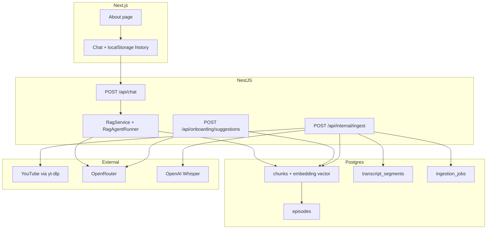

# Choque de Cultura RAG

**Idioma:** Português (Brasil) · **[English version](#english-version)** (seção colapsável no final)

Chat em português sobre o programa **Choque de Cultura** (humor e crítica de cinema/cultura pop, TV Quase), com respostas ancoradas em transcrições reais dos episódios no YouTube. Cada resposta relevante pode incluir **Citation Cards** (episódio, minuto e trecho) com link direto para o momento da fala.

**Interface:** [chat na raiz](/) · [página Sobre](/sobre) (contexto do programa, personagens e humor)

---

## Por que este repositório existe

Projeto **full-stack brownfield** (NestJS + Next.js já scaffolded) desenvolvido com **desenvolvimento orientado a especificação** via [BMad Method](https://github.com/bmad-code-org/BMad-Method): PRD, arquitetura, epics/stories e `project-context.md` em `_bmad-output/` antes e durante a implementação. O objetivo foi validar um pipeline real de **ingestão → vector store → RAG com guardrails → UX de chat**, não um mock de IA.

O domínio (fãs buscando *“em qual episódio falaram de X?”*) exige **timestamps confiáveis**, **citações verificáveis** e **recusa off-topic** — requisitos que aparecem explicitamente no contrato da API e nos testes.

---

## Stack

| Camada | Tecnologia |
|--------|------------|
| Monorepo | pnpm workspaces (`packages/backend`, `packages/frontend`) |
| API | NestJS 11, Zod (`nestjs-zod`), Swagger em `/api` |
| Frontend | Next.js 15 App Router, React 19, Tailwind 3 |
| Dados | PostgreSQL 16 + **pgvector**, Prisma 7 |
| IA | [`@luanpoppe/ai`](https://www.npmjs.com/package/@luanpoppe/ai) — única porta para chat, embeddings e STT |
| Roteamento LLM/embed | OpenRouter (`OPENROUTER_API_KEY`) |
| STT com segmentos | OpenAI `whisper-1` + `verbose_json` (timestamps reais; OpenRouter STT não expõe segmentos) |
| Áudio / metadados | yt-dlp |
| Testes | Jest + SWC |

---

## Arquitetura em alto nível


### Camadas no backend

| Pasta | Responsabilidade |
|-------|------------------|
| `core/` | `EnvService` (Zod), guards, Swagger |
| `shared/infrastructure/` | Prisma, pgvector, `AiService`, RAG, logging HTTP |
| `modules/` | HTTP: `chat`, `onboarding`, `ingestion` |

**Regra de dependência:** `modules` → `infrastructure` → `core` (nunca o inverso).

---

## Decisões técnicas que valem destaque

### 1. Spec-driven com BMad

Requisitos (FR/NFR), UX (`DESIGN.md`, `EXPERIENCE.md`) e ADRs vivem em `_bmad-output/planning-artifacts/`. Stories em `_bmad-output/implementation-artifacts/` com acceptance criteria e file list — reduz deriva entre “o que o PRD pediu” e o código.

### 2. Postgres + pgvector (sem Redis na v1)

Similaridade por `<=>` no mesmo banco da aplicação. Jobs de ingestão e status no Postgres; worker **in-process** no Nest — YAGNI para fila externa na PoC.

### 3. Chunking híbrido na ingestão

- Primeiros `INGEST_FINE_GRAINED_HEAD_SEC` (default **180s**): **1 segmento Whisper = 1 chunk ancorado** no timestamp (melhor para memes e falas curtas); texto do chunk inclui ±`INGEST_HEAD_CONTEXT_SEC` (default **20s**) de fala vizinha.
- Depois: janelas de `INGEST_CHUNK_DURATION_SEC` (default **30s**) com overlap **`INGEST_OVERLAP_RATIO`** (default **25%**).
- `transcript_segments` guarda segmentos STT; chunks referenciam `start_sec` / `end_sec` para links `?t=` no YouTube. Mudanças nas envs de chunking exigem **reingest**.

### 4. RAG como agente com tools (não retrieval fixo)

O fluxo antigo “embed → top-k → um prompt” foi substituído por **`RagAgentRunner`** com tools LangChain via `@luanpoppe/ai`:

| Tool | Função |
|------|--------|
| `search_archive` | `embedQuery` + top-k + threshold; até `RAG_AGENT_MAX_SEARCHES` (default 4) reformulações; retorna `text` + **`contextText`** (±`RAG_NEIGHBOR_CHUNKS` vizinhos no episódio) |
| `submit_answer` | Encerra com `offTopic`, `reply`, `citationChunkIds` |

Citações só de chunks **efetivamente recuperados** na sessão (máx. 3 cards). O `quote` nos cards usa o mesmo contexto expandido; `startSec`/`watchUrl` apontam para o chunk citado. Contrato HTTP inalterado: `{ reply, citations[], noMatch?, offTopic? }`.

### 5. Guardrails explícitos

- Classificação / recusa **off-topic** sem fabricar cards.
- `noMatch` quando não há trechos acima do threshold de distância.
- Ingestão protegida por `X-Ingest-Secret`; rate limit no chat.

### 6. `@luanpoppe/ai` como facade

Chat, embeddings e áudio passam por `AiService` — facilita trocar modelos no OpenRouter e isolar providers (ex.: Whisper direto na OpenAI para segmentos).

### 7. Frontend enxuto

Sem React Query na v1: axios + estado local; sessão e tema em `localStorage`. Design tokens em CSS variables + Tailwind (tema claro/escuro). Página **`/sobre`** para contexto do programa (TV Quase, “pilotos”, humor interno).

---

## Estrutura do monorepo

```
choque-de-cultura-rag/
├── packages/
│   ├── backend/          # NestJS — API, ingestão, RAG
│   │   ├── prisma/       # schema + migrations (pgvector)
│   │   └── src/
│   │       ├── core/
│   │       ├── modules/  # chat, ingestion, onboarding
│   │       └── shared/infrastructure/
│   └── frontend/         # Next.js — chat + /sobre
├── _bmad-output/         # PRD, arquitetura, epics, stories, project-context
├── docker-compose.yml    # Postgres + pgvector (porta host 6017)
├── .env.example
└── README.md
```

---

## Como rodar localmente

### Pré-requisitos

- Node 20+, pnpm
- Docker (Postgres)
- `yt-dlp` no PATH (ou `YTDLP_BIN` no `.env`)
- Chaves: `OPENROUTER_API_KEY`, `OPENAI_API_KEY` (ingestão STT), `INGEST_SECRET`

### Passos

```powershell
# 1. Banco
docker compose up -d

# 2. Variáveis
copy .env.example .env
# Edite DATABASE_URL, chaves de API, INGEST_SECRET, PORT=3011

# 3. Dependências e migrations
pnpm install
pnpm --filter @choque-de-cultura-rag/backend prisma:migrate

# 4. Dev (backend + frontend)
pnpm dev
```

- **Chat:** http://localhost:3000 (Next default; confira porta do `frontend/package.json`)
- **API:** `NEXT_PUBLIC_API_URL` → ex. http://localhost:3011
- **Swagger:** http://localhost:3011/api

### Ingestão (operador)

Configure `CHOQUE_YOUTUBE_CHANNEL_URL` com a [playlist oficial de episódios](https://www.youtube.com/playlist?list=PLA2Gd9vTv5MWbT1N-RVoTO7MHkfjKkYVV) (ou URL de canal com `/videos`). Sem `youtubeVideoIds` no body, o backend lista os N vídeos mais antigos via yt-dlp.

```powershell
# Disparar lote (header X-Ingest-Secret)
# POST /api/internal/ingest

pnpm --filter @choque-de-cultura-rag/backend archive:validate
pnpm --filter @choque-de-cultura-rag/backend reingest:force
```

Logs estruturados: `[IngestionJob:{id}] [Episode:{videoId}]`. RAG: `LOG_LEVEL=debug` para buscas e citações.

---

## Testes

```powershell
pnpm --filter @choque-de-cultura-rag/backend test
pnpm --filter @choque-de-cultura-rag/frontend lint
```

Foco em fluxos críticos: env Zod, RAG/agent tools, citation filter (legado), ingestão (mocks), guardrails off-topic / noMatch.

---

## Documentação do projeto (BMad)

| Artefato | Caminho |
|----------|---------|
| Contexto para agentes de código | `_bmad-output/project-context.md` |
| Arquitetura (ADRs, contratos API) | `_bmad-output/planning-artifacts/architecture.md` |
| Epics e stories | `_bmad-output/planning-artifacts/epics.md` |
| PRD | `_bmad-output/planning-artifacts/prds/prd-choque-de-cultura-rag-2026-06-03/` |
| UX | `_bmad-output/planning-artifacts/ux-designs/ux-choque-de-cultura-rag-2026-06-03/` |
| Status do sprint | `_bmad-output/implementation-artifacts/sprint-status.yaml` |

---

## Limitações conhecidas (PoC)

- Subconjunto de episódios indexados (~5–10 mais antigos), não o canal inteiro.
- Transcrição ASR pode errar nomes e gírias; sempre validar no YouTube.
- Sem diarização de speakers na v1 (FR-9 stretch).
- Latência de chat dependente de múltiplas chamadas LLM por turno.

---

## Aviso legal

Demo **educacional e pessoal**, sem afiliação oficial com Choque de Cultura, TV Quase, Omelete, Canal Brasil, Globoplay ou Porta dos Fundos. Conteúdo audiovisual pertence aos respectivos titulares.

---

## Licença

Código do repositório conforme licença do projeto (`UNLICENSED` nos packages — ajuste se publicar como open source).

---

<a id="english-version"></a>

<details>
<summary><strong>English version (README)</strong> — click to expand</summary>

<br />

**Language:** English · [Back to Portuguese](#choque-de-cultura-rag)

# Choque de Cultura RAG

Portuguese-language chat about the **Choque de Cultura** show (comedy and film/pop-culture commentary, TV Quase), with answers grounded in real transcripts from YouTube episodes. Each relevant reply can include **Citation Cards** (episode, timestamp, and excerpt) linking directly to the moment in the video.

**UI:** [chat at `/`](/) · [About page](/sobre) (show context, characters, and humor)

---

## Why this repository exists

A **brownfield full-stack** project (NestJS + Next.js already scaffolded) built with **spec-driven development** via the [BMad Method](https://github.com/bmad-code-org/BMad-Method): PRD, architecture, epics/stories, and `project-context.md` under `_bmad-output/` before and during implementation. The goal was to validate a real **ingestion → vector store → RAG with guardrails → chat UX** pipeline—not an AI mock.

The domain (fans asking *“which episode did they talk about X?”*) requires **reliable timestamps**, **verifiable citations**, and **off-topic refusal**—requirements spelled out in the API contract and tests.

---

## Stack

| Layer | Technology |
|--------|------------|
| Monorepo | pnpm workspaces (`packages/backend`, `packages/frontend`) |
| API | NestJS 11, Zod (`nestjs-zod`), Swagger at `/api` |
| Frontend | Next.js 15 App Router, React 19, Tailwind 3 |
| Data | PostgreSQL 16 + **pgvector**, Prisma 7 |
| AI | [`@luanpoppe/ai`](https://www.npmjs.com/package/@luanpoppe/ai) — single entry point for chat, embeddings, and STT |
| LLM/embed routing | OpenRouter (`OPENROUTER_API_KEY`) |
| Segmented STT | OpenAI `whisper-1` + `verbose_json` (real timestamps; OpenRouter STT does not return segments) |
| Audio / metadata | yt-dlp |
| Tests | Jest + SWC |

---

## High-level architecture



### Backend layers

| Folder | Responsibility |
|--------|----------------|
| `core/` | `EnvService` (Zod), guards, Swagger |
| `shared/infrastructure/` | Prisma, pgvector, `AiService`, RAG, HTTP logging |
| `modules/` | HTTP: `chat`, `onboarding`, `ingestion` |

**Dependency rule:** `modules` → `infrastructure` → `core` (never the reverse).

---

## Technical decisions worth highlighting

### 1. Spec-driven with BMad

Requirements (FR/NFR), UX (`DESIGN.md`, `EXPERIENCE.md`), and ADRs live in `_bmad-output/planning-artifacts/`. Stories in `_bmad-output/implementation-artifacts/` with acceptance criteria and file lists—reducing drift between “what the PRD asked for” and the code.

### 2. Postgres + pgvector (no Redis in v1)

Similarity search via `<=>` in the same database as the app. Ingestion jobs and status in Postgres; **in-process** worker in Nest—YAGNI for an external queue in the PoC.

### 3. Hybrid chunking on ingestion

- First `INGEST_FINE_GRAINED_HEAD_SEC` (default **180s**): **1 Whisper segment = 1 anchored chunk** (better for memes and short lines); chunk text includes ±`INGEST_HEAD_CONTEXT_SEC` (default **20s**) of neighboring speech.
- Then: `INGEST_CHUNK_DURATION_SEC` windows (default **30s**) with **`INGEST_OVERLAP_RATIO`** overlap (default **25%**).
- `transcript_segments` stores STT segments; chunks reference `start_sec` / `end_sec` for YouTube `?t=` links. Changing chunking env vars requires **reingest**.

### 4. RAG as an agent with tools (not fixed retrieval)

The old “embed → top-k → single prompt” flow was replaced by **`RagAgentRunner`** with LangChain tools via `@luanpoppe/ai`:

| Tool | Role |
|------|------|
| `search_archive` | `embedQuery` + top-k + threshold; up to `RAG_AGENT_MAX_SEARCHES` (default 4) reformulations; returns `text` + **`contextText`** (±`RAG_NEIGHBOR_CHUNKS` neighbors in the episode) |
| `submit_answer` | Ends with `offTopic`, `reply`, `citationChunkIds` |

Citations only from chunks **actually retrieved** in the session (max 3 cards). Card `quote` uses the same expanded context; `startSec`/`watchUrl` point at the cited chunk. HTTP contract unchanged: `{ reply, citations[], noMatch?, offTopic? }`.

### 5. Explicit guardrails

- **Off-topic** classification / refusal without fabricated cards.
- `noMatch` when no chunks pass the distance threshold.
- Ingestion protected by `X-Ingest-Secret`; rate limiting on chat.

### 6. `@luanpoppe/ai` as a facade

Chat, embeddings, and audio go through `AiService`—easier to swap OpenRouter models and isolate providers (e.g. Whisper on OpenAI directly for segments).

### 7. Lean frontend

No React Query in v1: axios + local state; session and theme in `localStorage`. Design tokens via CSS variables + Tailwind (light/dark). **`/sobre`** About page for show context (TV Quase, “drivers”, inside humor).

---

## Monorepo structure

```
choque-de-cultura-rag/
├── packages/
│   ├── backend/          # NestJS — API, ingestion, RAG
│   │   ├── prisma/       # schema + migrations (pgvector)
│   │   └── src/
│   │       ├── core/
│   │       ├── modules/  # chat, ingestion, onboarding
│   │       └── shared/infrastructure/
│   └── frontend/         # Next.js — chat + /sobre
├── _bmad-output/         # PRD, architecture, epics, stories, project-context
├── docker-compose.yml    # Postgres + pgvector (host port 6017)
├── .env.example
└── README.md
```

---

## Running locally

### Prerequisites

- Node 20+, pnpm
- Docker (Postgres)
- `yt-dlp` on PATH (or `YTDLP_BIN` in `.env`)
- Keys: `OPENROUTER_API_KEY`, `OPENAI_API_KEY` (ingestion STT), `INGEST_SECRET`

### Steps

```powershell
# 1. Database
docker compose up -d

# 2. Environment
copy .env.example .env
# Edit DATABASE_URL, API keys, INGEST_SECRET, PORT=3011

# 3. Dependencies and migrations
pnpm install
pnpm --filter @choque-de-cultura-rag/backend prisma:migrate

# 4. Dev (backend + frontend)
pnpm dev
```

- **Chat:** http://localhost:3000 (Next default; check `frontend/package.json` port)
- **API:** `NEXT_PUBLIC_API_URL` → e.g. http://localhost:3011
- **Swagger:** http://localhost:3011/api

### Ingestion (operator)

Set `CHOQUE_YOUTUBE_CHANNEL_URL` to the [official episode playlist](https://www.youtube.com/playlist?list=PLA2Gd9vTv5MWbT1N-RVoTO7MHkfjKkYVV) (or a channel URL with `/videos`). Without `youtubeVideoIds` in the body, the backend lists the N oldest videos via yt-dlp.

```powershell
# Trigger batch (X-Ingest-Secret header)
# POST /api/internal/ingest

pnpm --filter @choque-de-cultura-rag/backend archive:validate
pnpm --filter @choque-de-cultura-rag/backend reingest:force
```

Structured logs: `[IngestionJob:{id}] [Episode:{videoId}]`. RAG: `LOG_LEVEL=debug` for searches and citations.

---

## Tests

```powershell
pnpm --filter @choque-de-cultura-rag/backend test
pnpm --filter @choque-de-cultura-rag/frontend lint
```

Focus on critical paths: Zod env, RAG/agent tools, citation filter (legacy), ingestion (mocks), off-topic / noMatch guardrails.

---

## Project documentation (BMad)

| Artifact | Path |
|----------|------|
| Context for coding agents | `_bmad-output/project-context.md` |
| Architecture (ADRs, API contracts) | `_bmad-output/planning-artifacts/architecture.md` |
| Epics and stories | `_bmad-output/planning-artifacts/epics.md` |
| PRD | `_bmad-output/planning-artifacts/prds/prd-choque-de-cultura-rag-2026-06-03/` |
| UX | `_bmad-output/planning-artifacts/ux-designs/ux-choque-de-cultura-rag-2026-06-03/` |
| Sprint status | `_bmad-output/implementation-artifacts/sprint-status.yaml` |

---

## Known limitations (PoC)

- Subset of indexed episodes (~5–10 oldest), not the full channel.
- ASR transcription may miss names and slang; always verify on YouTube.
- No speaker diarization in v1 (FR-9 stretch).
- Chat latency depends on multiple LLM calls per turn.

---

## Legal notice

**Educational and personal** demo, not officially affiliated with Choque de Cultura, TV Quase, Omelete, Canal Brasil, Globoplay, or Porta dos Fundos. Audiovisual content belongs to the respective rights holders.

---

## License

Repository code under the project license (`UNLICENSED` in packages—update if publishing as open source).

</details>
